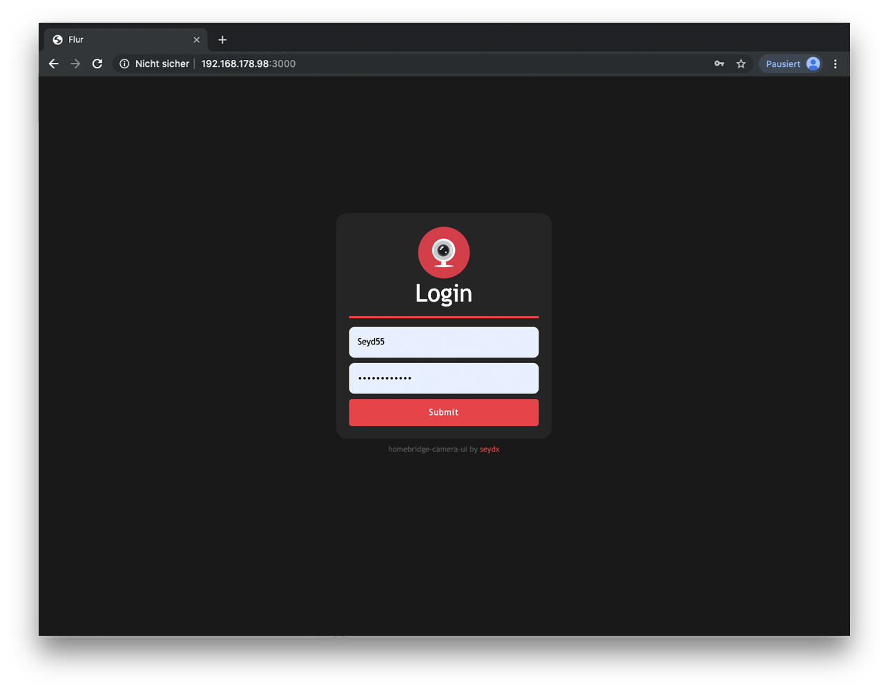
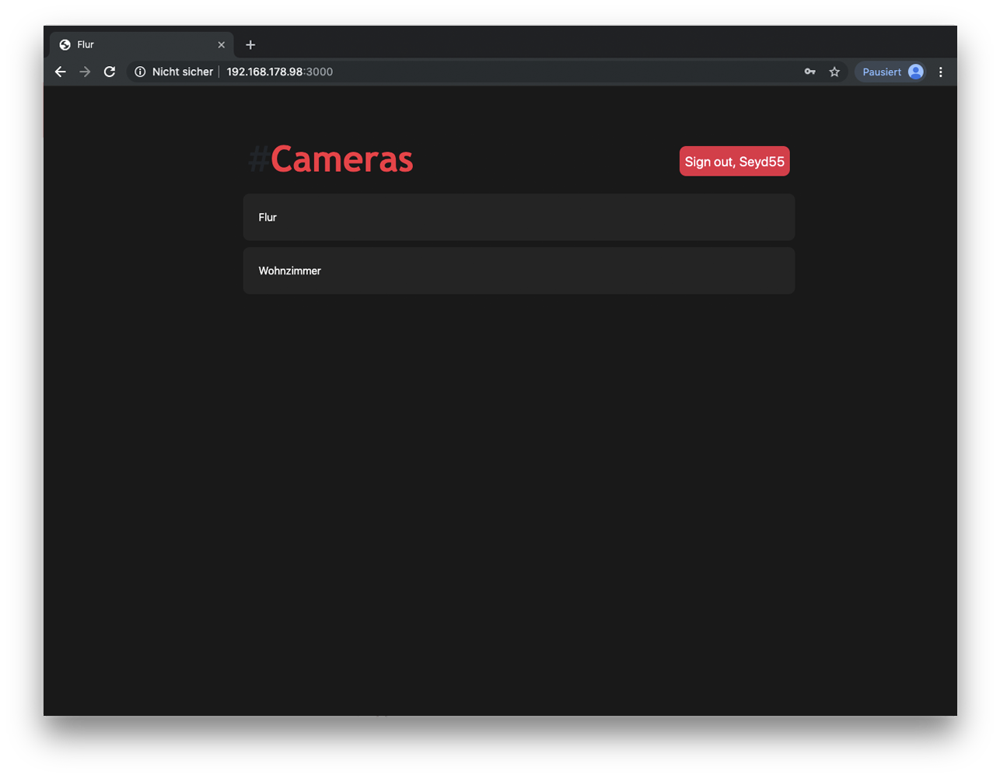
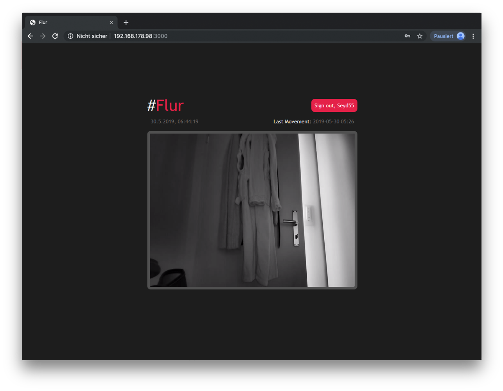

<p align="center">
    
</p>


# Camera!UI v2

[](https://www.npmjs.com/package/homebridge-camera-ui)
[](https://www.npmjs.com/package/homebridge-camera-ui)
[](https://github.com/SeydX/homebridge-camera-ui)
[](https://www.paypal.com/cgi-bin/webscr?cmd=_s-xclick&hosted_button_id=NP4T3KASWQLD8)

**Creating and maintaining Homebridge plugins consume a lot of time and effort, if you would like to share your appreciation, feel free to "Star" or donate.**


This is a dynamic platform plugin for [Homebridge](https://github.com/nfarina/homebridge) to control your RTSP Cameras with MQTT (motion), GUI (Access to stream via http), Telegram notification and FakeGato Support. 

This Plugin creates one accessory with two services. A camera service to access your camera via RTSP and a Motion Sensor service with FakeGato functionality to check the last movement and more. It creates also some custom characteristics to switch camera settings, eg SSH, FTP, Telnet etc within 3rd party apps like Elgato EVE. _(Custom Characteristics only for YI Cameras with YI-HACK v4)_

You can also set up the notifier to get a Telegram notification with customized messages and markdown capability when motion detected/undetected.

Last but not least, you can activate "GUI" to access the Stream via webbrowser on any device! On iOS devices you have also the possibility to save the website as a web application to your home screen.

## Documentation

- <u>Installation<u>
   * [Installation NPM](https://github.com/SeydX/homebridge-camera-ui#installation-instructions)
   * [OS instructions FFmpeg](https://github.com/SeydX/homebridge-camera-ui#os-instructions-ffmpeg)
- Configuration
   * [Explanation](https://github.com/SeydX/homebridge-camera-ui/blob/master/docs/CONFIG.md)
   * [Basic Config.json](https://github.com/SeydX/homebridge-camera-ui#basic-configuration)
   * [Extended Config.json](https://github.com/SeydX/homebridge-camera-ui/blob/master/example-config.json)
- <u>GUI<u>
   * [Web Access](https://github.com/SeydX/homebridge-camera-ui/blob/master/docs/CONFIG.md)
   * [iOS Web Application](https://github.com/SeydX/homebridge-camera-ui#ios-web-application)
- <u>Supported apps<u>
    * [Supported clients](https://github.com/SeydX/homebridge-camera-ui#supported-clients)
    * [Supported cameras](https://github.com/SeydX/homebridge-camera-ui#supported-cameras)
    
## Changelog

See the [changelog](https://github.com/SeydX/homebridge-camera-ui/blob/master/CHANGELOG.md) for changes between versions of this package.

## Installation instructions

After [Homebridge](https://github.com/nfarina/homebridge) has been installed:

-  ```(sudo) npm i -g homebridge-camera-ui@latest```

You also need a programm to handle the stream. I recommend to use [FFmpeg](https://github.com/FFmpeg/FFmpeg)

See [OS instructions](https://github.com/SeydX/homebridge-camera-ui/blob/master/README.md#os-instructions-ffmpeg) for detailed installation instruction regarding to your OS

## Basic configuration

 ```
{
  "bridge": {
    ...
  },
  "accessories": [
    ...
  ],
  "platforms": [
    {
      "platform": "CameraUI",
      "videoProcessor": "ffmpeg",
      "cameras": [
        {
          "name": "Flur",
          "active": true,
          "videoConfig": {
            "source": "-rtsp_transport tcp -re -i rtsp://192.168.178.31/ch0_0.h264",
            "maxWidth": 1920,
            "maxHeight": 1080,
            "maxFPS": 30
          }
        }
      ]
    }
  ]
}
 ```
 See [Example Config](https://github.com/SeydX/homebridge-camera-ui/blob/master/example-config.json) for more detailsand options!

## OS instructions (FFmpeg)

**Mac OS:** 

To install this utility on OS X, just head over to [ffmpeg.org](https://www.ffmpeg.org/download.html#build-mac), download the release relative to your Macs architecture. Then put the application into an accessible directory and run it from command line. Another way is using [HomeBrew](https://www.howtogeek.com/211541/homebrew-for-os-x-easily-installs-desktop-apps-and-terminal-utilities/)

For example

```brew install ffmpeg --with-fdk-aac --with-ffplay --with-libass --with-libvorbis --with-libvpx --with-rtmpdump --with-openh264 --with-tools```

**Windows:** 

To install this utility on Windows, head over to [ffmpeg.org](https://www.ffmpeg.org/download.html#build-windows) and follow the download link, using your architecture. Then place the downloaded software into an accessible directory and run from command line. 

**Linux:** 

To install this utility on Unix, just follow the instructions found at [ffmpeg.org](https://www.ffmpeg.org/download.html#build-linux) 

To check if ffmpeg is installed correctly and see a list of available commands try running the following command in the command line:

```ffmpeg -help```

**Homebridge Docker:** 

Add FFmpeg to packages

```PACKAGES=ffmpeg```


## GUI Access

After setting up the gui part in config.json, just open ```http://localhost:<port_config.json>``` and you are ready. Credentials are these setted up in config.json as username and password.







## iOS Web Application

- Open Safari. Other browsers, such as Chrome, won’t work for this.
- Navigate to ```http://localhost:<port_config.json>```
- Tap the Share button at the bottom of the page.
- On the bottom row of icons, scroll over until you see Add to Home Screen and tap this.
- On the next screen, choose a name for the link on your home screen. You’ll see the link so you can confirm it, as well as the site’s favicon that becomes its “app” icon.
- Now just tap the new app on your home screen, and it will open the website in its own navigation window, independent of Safari.

## Supported clients

This plugin has been verified to work with the following apps on iOS 12.2 and iOS 12.3 Beta:

* iOS 12
* Apple Home
* All 3rd party apps like Elgato Eve etc (recommended for custom characteristics)
* Homebridge v0.4.49

## Supported Cameras

- Every camera with an RTSP stream

## Contributing

- This plugin uses a modified version of the [homebridge-camera-ffmpeg](https://github.com/KhaosT/homebridge-camera-ffmpeg) plugin from [@KhaosT](https://github.com/KhaosT)

- Credits goes also to [@phoboslab](https://github.com/phoboslab) for the wonderful decoder AND [@TheCrypt0](https://github.com/TheCrypt0) for the awesome hack!

You can contribute to this homebridge plugin in following ways:

- [Report issues](https://github.com/SeydX/homebridge-camera-ui/issues) and help verify fixes as they are checked in.
- Review the [source code changes](https://github.com/SeydX/homebridge-camera-ui/pulls).
- Contribute bug fixes.
- Contribute changes to extend the capabilities

Pull requests are accepted.


## Troubleshooting

If you have any issues with the plugin then you can run this plugin in debug mode, which will provide some additional information. This might be useful for debugging issues. Just open your config.json and set debug to true!


## Licens

**MIT License**

Copyright (c) 2019 **Seyit Bayraktar**

Permission is hereby granted, free of charge, to any person obtaining a copy
of this software and associated documentation files (the "Software"), to deal
in the Software without restriction, including without limitation the rights
to use, copy, modify, merge, publish, distribute, sublicense, and/or sell
copies of the Software, and to permit persons to whom the Software is
furnished to do so, subject to the following conditions:

The above copyright notice and this permission notice shall be included in all
copies or substantial portions of the Software.

THE SOFTWARE IS PROVIDED "AS IS", WITHOUT WARRANTY OF ANY KIND, EXPRESS OR
IMPLIED, INCLUDING BUT NOT LIMITED TO THE WARRANTIES OF MERCHANTABILITY,
FITNESS FOR A PARTICULAR PURPOSE AND NONINFRINGEMENT. IN NO EVENT SHALL THE
AUTHORS OR COPYRIGHT HOLDERS BE LIABLE FOR ANY CLAIM, DAMAGES OR OTHER
LIABILITY, WHETHER IN AN ACTION OF CONTRACT, TORT OR OTHERWISE, ARISING FROM,
OUT OF OR IN CONNECTION WITH THE SOFTWARE OR THE USE OR OTHER DEALINGS IN THE
SOFTWARE.
