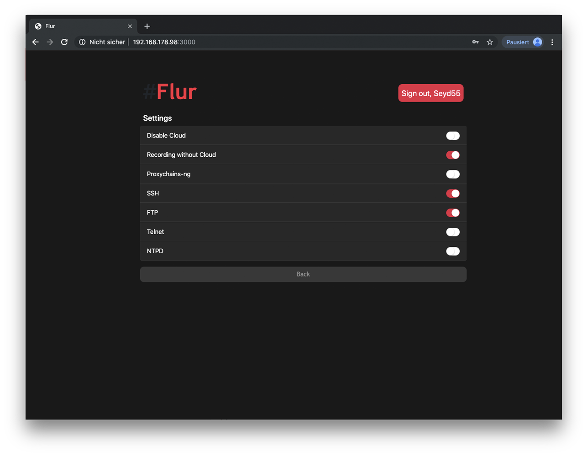

<p align="center">
    
</p>


# Camera!UI v2

[](https://www.npmjs.com/package/homebridge-camera-ui)
[](https://www.npmjs.com/package/homebridge-camera-ui)
[](https://github.com/SeydX/homebridge-camera-ui)
[](https://www.paypal.com/cgi-bin/webscr?cmd=_s-xclick&hosted_button_id=NP4T3KASWQLD8)

**Creating and maintaining Homebridge plugins consume a lot of time and effort, if you would like to share your appreciation, feel free to "Star" or donate.**


This is a dynamic platform plugin for [Homebridge](https://github.com/nfarina/homebridge) to control your RTSP Cameras with MQTT (motion), FTP (motion), GUI (Access to stream via http), Telegram notification and FakeGato Support. 

This Plugin creates one accessory with two services. A camera service to access your camera via RTSP and a Motion Sensor service with FakeGato functionality to check the last movement and more. It creates also some custom characteristics to switch camera settings, eg SSH, FTP, Telnet etc within 3rd party apps like Elgato EVE. _(Custom Characteristics only for YI Cameras with YI-HACK v4)_

You can also set up the notifier to get a Telegram notification with customized messages and markdown capability when motion detected/undetected.

Last but not least, you can activate "GUI" to access the Stream via webbrowser on any device! On iOS devices you have also the possibility to save the website as a web application to your home screen.

## Documentation

- <u>Installation<u>
   * [Installation NPM](https://github.com/SeydX/homebridge-camera-ui#installation-instructions)
- <u>OS Instructions for FFMPEG<u>
   * [Mac OS](https://github.com/SeydX/homebridge-camera-ui#mac-os)
   * [Window](https://github.com/SeydX/homebridge-camera-ui#windows)
   * [Linux](https://github.com/SeydX/homebridge-camera-ui#linux)
- <u>Configuration<u>
   * [Explanation](https://github.com/SeydX/homebridge-camera-ui/blob/master/docs/CONFIG.md)
   * [Basic Camera Config](https://github.com/SeydX/homebridge-camera-ui#basic-configuration)
   * [Basic Camera Config + MQTT](https://github.com/SeydX/homebridge-camera-ui#movement-configuration-mqtt)
   * [Basic Camera Config + FTP](https://github.com/SeydX/homebridge-camera-ui#movement-configuration-ftp)
   * [Extended Config.json](https://github.com/SeydX/homebridge-camera-ui/blob/master/example-config.json)
- <u>GUI<u>
   * [Basic Camera Config + GUI](https://github.com/SeydX/homebridge-camera-ui#gui-access)
   * [Basic Camera Config + GUI for hacked YI Cameras](https://github.com/SeydX/homebridge-camera-ui#yi-cameras-with-yi-hack-v4)
   * [iOS Web Application](https://github.com/SeydX/homebridge-camera-ui#ios-web-application)
- <u>Notifier<u>
   * [Basic Camera Config + MQTT + Notifier](https://github.com/SeydX/homebridge-camera-ui#notifier)
- <u>FAQ<u>
   * [Choppy Streams](https://github.com/SeydX/homebridge-camera-ui#not-responsive-or-choppy-streams)
- <u>Supported apps<u>
    * [Supported Clients](https://github.com/SeydX/homebridge-camera-ui#supported-clients)
    * [Supported Cameras](https://github.com/SeydX/homebridge-camera-ui#supported-cameras)
    
## Changelog

See the [changelog](https://github.com/SeydX/homebridge-camera-ui/blob/master/CHANGELOG.md) for changes between versions of this package.

## Todo
- [ ] Accounts and register option for GUI
- [ ] Change Color

## Installation instructions

After [Homebridge](https://github.com/nfarina/homebridge) has been installed:

-  ```(sudo) npm i -g homebridge-camera-ui@latest```

You also need a programm to handle the stream. I recommend to use [FFmpeg](https://github.com/FFmpeg/FFmpeg)

See [OS instructions](https://github.com/SeydX/homebridge-camera-ui/blob/master/README.md#os-instructions-ffmpeg) for detailed installation instruction regarding to your OS

## Camera

### Basic Configuration

 ```
{
  "bridge": {
    ...
  },
  "accessories": [
    ...
  ],
  "platforms": [
    {
      "platform": "CameraUI",
      "videoProcessor": "ffmpeg",
      "cameras": [
        {
          "name": "Flur",
          "active": true,
          "videoConfig": {
            "source": "-rtsp_transport tcp -re -i rtsp://192.168.178.31/ch0_0.h264",
            "maxWidth": 1920,
            "maxHeight": 1080,
            "maxFPS": 30
          }
        }
      ]
    }
  ]
}
 ```
 
See [Example Config](https://github.com/SeydX/homebridge-camera-ui/blob/master/example-config.json) for more details and options!
 
 ## Movement Detection
 
This plugin offers two possibilities to get movement detection on your camera. MQTT and FTP.

- For MQTT, the camera need to have this capability, otherwise it is not possible to use MQTT for movement detection. The plugin listen to the server for the start and stop message setted up in config.json.

- For FTP, the camera need to have the capability to upload images to a FTP server by movement detection. If your camera has this ability, the plugin can scan the folder where the images are uploaded. The plugin compare all images and take the latest uploaded image and use the timestamp for movement detection. (Only if the latest image is newer than the image before stored in accessory cache). You can also set up a "duration" to hold the "movement detected" state.
 
 ### Movement Configuration MQTT
 
  ```
{
  "bridge": {
    ...
  },
  "accessories": [
    ...
  ],
  "platforms": [
    {
      "platform": "CameraUI",
      "videoProcessor": "ffmpeg",
      "cameras": [
        {
          "name": "Flur",
          "active": true,
          "videoConfig": {
            "source": "-rtsp_transport tcp -re -i rtsp://192.168.178.31/ch0_0.h264",
            "maxWidth": 1920,
            "maxHeight": 1080,
            "maxFPS": 30
          },
          "mqtt": {
            "active": true,
            "host": "192.168.178.123",
            "port": 1883,
            "username": "",
            "password": "",
            "topicPrefix": "yicam",
            "topicSuffix": "motion",
            "startMessage": "motion_start",
            "stopMessage": "motion_stop",
            "recordOnMovement": true,
            "recordVideoSize": 30
            "interval": 120
          }
        }
      ]
    }
  ]
}
```
 
 ### Movement Configuration FTP
 

 ```
{
  "bridge": {
    ...
  },
  "accessories": [
    ...
  ],
  "platforms": [
    {
      "platform": "CameraUI",
      "videoProcessor": "ffmpeg",
      "cameras": [
        {
          "name": "Flur",
          "active": true,
          "videoConfig": {
            "source": "-rtsp_transport tcp -re -i rtsp://192.168.178.31/ch0_0.h264",
            "maxWidth": 1920,
            "maxHeight": 1080,
            "maxFPS": 30
          },
          "ftp":{
            "active":true,
	        "host":"192.168.178.1",
	        "username":"MyUsername",
	        "password":"MyPassword",
	        "secure":false,
	        "absolutePath":"Recordings",
            "movementDuration":20,
            "recordOnMovement": true,
            "recordVideoSize": 30
            "interval": 120
          }
        }
      ]
    }
  ]
}
```
 
See [Example Config](https://github.com/SeydX/homebridge-camera-ui/blob/master/example-config.json) for more details and options!

## GUI Access

After setting up the gui part in config.json, just open ```http://localhost:<port_config.json>``` and you are ready. Credentials are these setted up in config.json as username and password. _(Maybe you need to replace localhost with the ip address where the plugin/homebridge runs)_

You don't need to "activate" the camera(s) if you want only access the camera over GUI.

### GUI Config

 ```
{
  "bridge": {
    ...
  },
  "accessories": [
    ...
  ],
  "platforms": [
    {
      "platform": "CameraUI",
      "videoProcessor": "ffmpeg",
      "cameras": [
        {
          "name": "Flur",
          "active": true,
          "videoConfig": {
            "source": "-rtsp_transport tcp -re -i rtsp://192.168.178.31/ch0_0.h264",
            "maxWidth": 1920,
            "maxHeight": 1080,
            "maxFPS": 30
          }
        }
      ],
      "gui": {
        "active": true,
        "username": "MyUsername",
        "password": "MySuperSecretPassword",
        "port": 3000,
        "wsport": 8100
      }
    }
  ]
}
 ```
 See [Example Config](https://github.com/SeydX/homebridge-camera-ui/blob/master/example-config.json) for more details and options!


## YI Cameras with YI-HACK-V4

For YI Cameras with YI-HACK-V4 this plugin offers custom characteristics and a "settings" page where you can change some settings like Enable/Disable SSH, FTP, Telnet etc. To use this, u need to pass "yihackv4" into your config.json, ie.

### Yi Camera Config

 ```
{
  "bridge": {
    ...
  },
  "accessories": [
    ...
  ],
  "platforms": [
    {
      "platform": "CameraUI",
      "debug": false,
      "videoProcessor": "ffmpeg",
      "cameras": [
        {
          "name": "Flur",
          "active": true,
          "yihackv4": true,
          "videoConfig": {
            "source": "-rtsp_transport tcp -re -i rtsp://192.168.178.31/ch0_0.h264",
            "maxWidth": 1920,
            "maxHeight": 1080,
            "maxFPS": 30
          }
        }
      ]
    }
  ]
}
 ```



## iOS Web Application

- Open Safari. Other browsers, such as Chrome, won’t work for this.
- Navigate to ```http://localhost:<port_config.json>```
- Tap the Share button at the bottom of the page.
- On the bottom row of icons, scroll over until you see Add to Home Screen and tap this.
- On the next screen, choose a name for the link on your home screen. You’ll see the link so you can confirm it, as well as the site’s favicon that becomes its “app” icon.
- Now just tap the new app on your home screen, and it will open the website in its own navigation window, independent of Safari.

## Notifier

In regarding to movement detection, this pluggin offers also a notification system via Telegram. You can set up movement detection/no movement in config.json. This plugin sends also captured images/videos (if setted up in config.json) via Telegram.

It supports also markdown


```
*bold text*
_italic text_
[inline URL](http://www.example.com/)
[inline mention of a user](tg://user?id=123456789)
`inline fixed-width code`
block_language
pre-formatted fixed-width code block
```


### Notifier Config

  ```
{
  "bridge": {
    ...
  },
  "accessories": [
    ...
  ],
  "platforms": [
    {
      "platform": "CameraUI",
      "videoProcessor": "ffmpeg",
      "cameras": [
        {
          "name": "Flur",
          "active": true,
          "videoConfig": {
            "source": "-rtsp_transport tcp -re -i rtsp://192.168.178.31/ch0_0.h264",
            "maxWidth": 1920,
            "maxHeight": 1080,
            "maxFPS": 30
          },
          "mqtt": {
            "active": true,
            "host": "192.168.178.123",
            "port": 1883,
            "username": "",
            "password": "",
            "topicPrefix": "yicam",
            "topicSuffix": "motion",
            "startMessage": "motion_start",
            "stopMessage": "motion_stop",
            "recordOnMovement": true,
            "recordVideoSize": 30
            "interval": 120
          }
        }
      ],
      "notifier":{
        "active":true,
        "token":"TelegramToken",
        "chatID":"TelegramChatID",
        "motion_start":"Motion *detected*",
        "motion_stop":"*No* motion"
      }
    }
  ]
}
```

## OS instructions (FFmpeg)

### Mac OS:

To install this utility on OS X, just head over to [ffmpeg.org](https://www.ffmpeg.org/download.html#build-mac), download the release relative to your Macs architecture. Then put the application into an accessible directory and run it from command line. Another way is using [HomeBrew](https://www.howtogeek.com/211541/homebrew-for-os-x-easily-installs-desktop-apps-and-terminal-utilities/)

For example

```brew install ffmpeg --with-fdk-aac --with-ffplay --with-libass --with-libvorbis --with-libvpx --with-rtmpdump --with-openh264 --with-tools```

### Windows:

To install this utility on Windows, head over to [ffmpeg.org](https://www.ffmpeg.org/download.html#build-windows) and follow the download link, using your architecture. Then place the downloaded software into an accessible directory and run from command line. 

### Linux:

To install this utility on Unix, just follow the instructions found at [ffmpeg.org](https://www.ffmpeg.org/download.html#build-linux) 

To check if ffmpeg is installed correctly and see a list of available commands try running the following command in the command line:

```ffmpeg -help```

**Homebridge Docker:** 

Add FFmpeg to packages

```PACKAGES=ffmpeg```

## FAQ

### Not responsive or choppy streams

There are a few factors involved. To know why the stream arrives delayed or choppy, the following points should be considered.

**What kind of system is it?** 

It seems, the slower the system, the slower the stream
 
**If it runs on a weak system like Raspi, what could you do to reduce the required processing power of FFMPEG?**

For example, you could lower the resolution here, make bitrate (maxBitrate) less, define rtsp transport (-rtsp_transport), change packet size (packetSize> multiplier x188) etc

**What to do if that does not help and the picture still stops or is greatly delayed?**

See if the stream is running well on eg VLC. If, for example, everything is good on VLC then it depends mostly because the processing power is much larger. If the stream also delayed or choppy on eg VLC, then you should try to fix the camera

## Supported clients

This plugin has been verified to work with the following apps on iOS 12/13:

* iOS 12/13
* Apple Home
* All 3rd party apps like Elgato Eve etc (recommended for custom characteristics)
* Homebridge v0.4.49

## Supported Cameras

- Every camera with an RTSP stream

## Contributing

- This plugin uses a modified version of the [homebridge-camera-ffmpeg](https://github.com/KhaosT/homebridge-camera-ffmpeg) plugin from [@KhaosT](https://github.com/KhaosT)

- Credits goes also to [@phoboslab](https://github.com/phoboslab) for the wonderful decoder AND [@TheCrypt0](https://github.com/TheCrypt0) for the awesome hack!

You can contribute to this homebridge plugin in following ways:

- [Report issues](https://github.com/SeydX/homebridge-camera-ui/issues) and help verify fixes as they are checked in.
- Review the [source code changes](https://github.com/SeydX/homebridge-camera-ui/pulls).
- Contribute bug fixes.
- Contribute changes to extend the capabilities

Pull requests are accepted.


## Troubleshooting

If you have any issues with the plugin then you can run this plugin in debug mode, which will provide some additional information. This might be useful for debugging issues. Just open your config.json and set debug to true!


## Licens

**MIT License**

Copyright (c) 2019 **Seyit Bayraktar**

Permission is hereby granted, free of charge, to any person obtaining a copy
of this software and associated documentation files (the "Software"), to deal
in the Software without restriction, including without limitation the rights
to use, copy, modify, merge, publish, distribute, sublicense, and/or sell
copies of the Software, and to permit persons to whom the Software is
furnished to do so, subject to the following conditions:

The above copyright notice and this permission notice shall be included in all
copies or substantial portions of the Software.

THE SOFTWARE IS PROVIDED "AS IS", WITHOUT WARRANTY OF ANY KIND, EXPRESS OR
IMPLIED, INCLUDING BUT NOT LIMITED TO THE WARRANTIES OF MERCHANTABILITY,
FITNESS FOR A PARTICULAR PURPOSE AND NONINFRINGEMENT. IN NO EVENT SHALL THE
AUTHORS OR COPYRIGHT HOLDERS BE LIABLE FOR ANY CLAIM, DAMAGES OR OTHER
LIABILITY, WHETHER IN AN ACTION OF CONTRACT, TORT OR OTHERWISE, ARISING FROM,
OUT OF OR IN CONNECTION WITH THE SOFTWARE OR THE USE OR OTHER DEALINGS IN THE
SOFTWARE.
